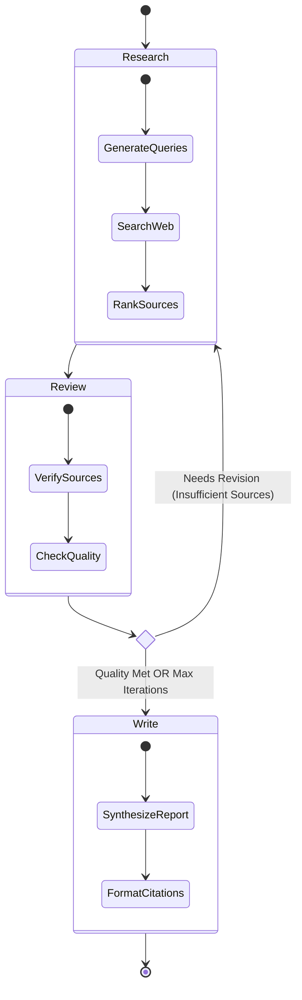

# Agent Workflow: Recursive Research

## The Recursive Loop
The core innovation of this system is the "Recursive Research" loop, where the agents don't just execute linearly but can loop back to refine their results based on quality checks.

## Agent Responsibilities

### 1. Research Agent (`src/agents/research_agent.py`)
*   **Input**: Query, Context (Error Message from previous loop)
*   **Process**:
    *   Generates search queries using LLM.
    *   *Agentic Behavior*: Adapts queries based on `error_message` context (e.g., "Try broader terms").
    *   Executes web searches (Tavily/Serper).
    *   Filters and ranks results.
*   **Output**: List of candidate `Source` objects.

### 2. Reviewer Agent (`src/agents/reviewer_agent.py`)
*   **Input**: Candidate Sources
*   **Process**:
    *   Verifies each source using LLM (checking for facts vs. SEO spam).
    *   Detects conflicting information.
    *   Calculates confidence score.
    *   *Decision*: Checks if `verified_sources >= min_threshold`.
*   **Output**:
    *   Pass: `verified_sources` and continue to Write.
    *   Fail: `needs_revision` status and `error_message` feedback.

### 3. Writer Agent (`src/agents/writer_agent.py`)
*   **Input**: Verified Sources, Conflicts
*   **Process**:
    *   Synthesizes a markdown report.
    *   Compiles citations.
*   **Output**: Final Report.
