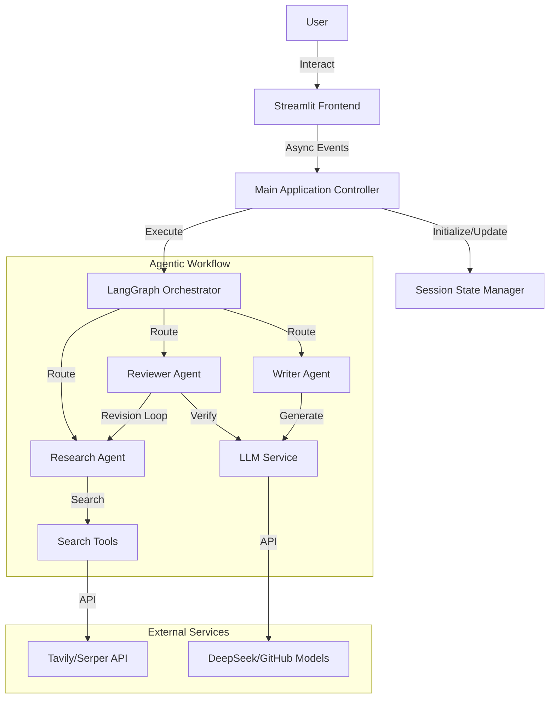

# Architecture Overview

## System Context
The Deep Research Assistant is a Streamlit-based web application that orchestrates AI agents to perform deep web research. It utilizes LangGraph for state management and workflow orchestration, allowing for cyclical and recursive research patterns.

## High-Level Architecture

## Core Components
1.  **Streamlit Frontend**: Handles user input, displays chat interface, and renders real-time progress updates via a status panel.
2.  **State Manager**: Manages `ResearchState` within the Streamlit session, ensuring data persistence across re-runs.
3.  **LangGraph Orchestrator**: Defines the state machine for the research workflow, including nodes (agents) and edges (transitions).
4.  **Agents**:
    *   **Research Agent**: Generates queries and retrieves information.
    *   **Reviewer Agent**: Verifies information and checks quality.
    *   **Writer Agent**: Synthesizes information into a final report.
5.  **Utilities**:
    *   **Config**: Centralized configuration management with strict validation.
    *   **LLM Client**: Factory for creating configured LLM clients.
    *   **Streaming**: real-time event streaming to the UI.

## Key Design Decisions
*   **Async/Await**: The core workflow runs asynchronously to prevent blocking the UI during long-running research tasks.
*   **State Decoupling**: The `ResearchState` Pydantic model is decoupled from the UI, serving as the single source of truth.
*   **Provider Agnostic**: The system is designed to support multiple LLM and search providers via configuration.
