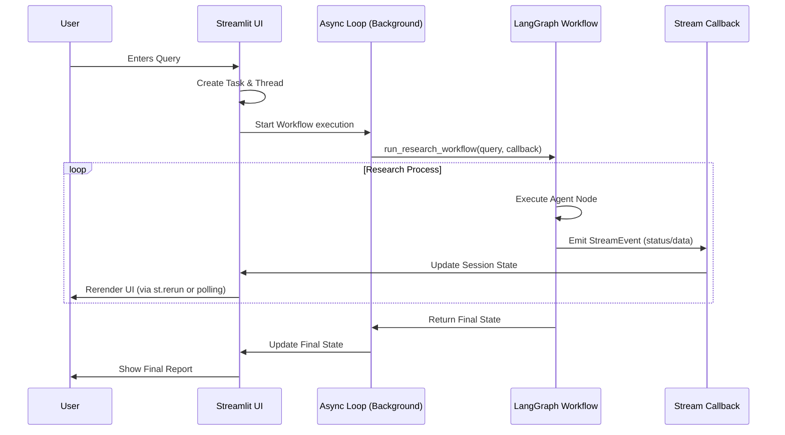

# Data Flow & State Management

## Async Data Flow
The application uses an asynchronous, event-driven architecture to communicate between the Streamlit frontend and the LangGraph backend.

## State Management
The `ResearchState` Pydantic model is the core data structure passed between agents.

### State Lifecycle
1.  **Initialization**: Created in `src/main.py` when a new query is submitted.
2.  **Processing**: Passed through the LangGraph workflow, where agents modify it (adding sources, updating status).
3.  **Streaming**: Intermediate updates are pushed to the UI via `StreamEvent`.
4.  **Persistence**: Stored in `st.session_state` to survive Streamlit re-runs.

### Concurrency
*   Each query has a unique `query_id`.
*   Session state keys are namespaces with `query_id` to allow multiple concurrent research sessions (if supported by UI).
*   Background threads operate on their own event loops to avoid blocking the main thread.
